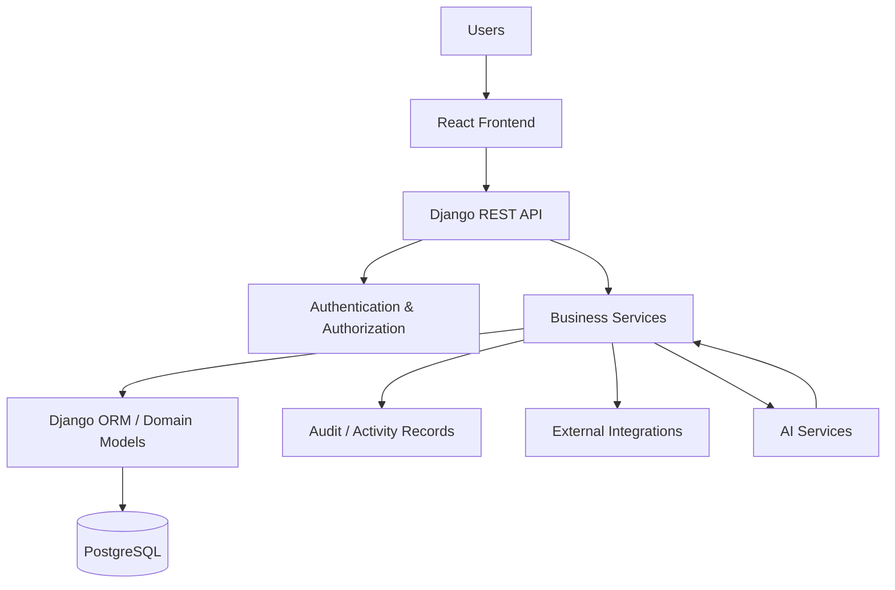

# GlintPM Private — System Architecture

## Purpose
This document defines the target system architecture for GlintPM Private. The repository remains the source of truth for what is actually implemented.

## Architecture Principles
- Domain-first design
- Clear separation of concerns
- API-driven communication
- Secure-by-default access
- Data integrity over convenience
- Explicit business rules
- Testable components
- Observable production behavior
- Incremental development
- Human ownership of AI-assisted implementation

## High-Level Architecture



## Logical Layers
1. **Presentation:** UI, navigation, forms, client state.
2. **API:** HTTP endpoints, contracts, validation, API errors.
3. **Business:** Project-control rules, calculations, workflows.
4. **Data:** Persistence, relationships, constraints, transactions.
5. **Integration:** External systems and services.

## Core Project-Control Flow

```text
Plan → Baseline → Actual / Progress → Variance → Forecast → Exception → Action → Decision
```

## Request Flow

```text
Browser → React → HTTP → Django API → Authentication → Authorization
→ Validation → Business Logic → Database → Response → Frontend → User
```

## AI Boundary
AI should assist analysis rather than silently modify authoritative project records.

```text
Authorized Data → AI Analysis → Generated Insight → Human Review → Decision / Action
```

## Architecture Governance
Major architectural changes should be documented as Architecture Decision Records under `/docs/decisions/`.

## Verification Status
This is the architecture baseline. Repository-specific implementation status must be verified through codebase audit.
