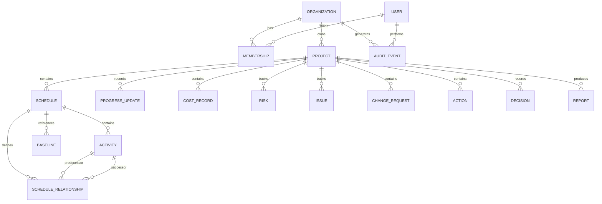

# Entity Relationship Model

- **Status:** Architectural baseline
- **Date:** 2026-10-05

## Purpose

This document describes conceptual relationships between major GlintPM Private entities. The exact schema must be derived from repository models and migrations.

## Conceptual ER diagram

## Relationship rules

- An organization can have many memberships.
- A user may belong to multiple organizations if supported.
- Every tenant-owned project has a clear organization owner.
- A project may contain multiple schedule versions/datasets.
- A schedule contains many activities.
- Activity relationships define predecessor/successor logic.
- A project may have multiple historical baselines.
- Progress, cost, risk, issue, change, action, decision, and report records belong to an appropriate project scope.
- Audit events retain organization and actor context where applicable.

## Referential integrity

Foreign keys should prevent orphaned records. Deletion behavior must be explicitly selected as cascade, restrict, set-null, or soft delete according to business requirements.

## Tenant boundaries

Organization-owned relationship chains must preserve tenant isolation. A project in Organization A must not reference organization-owned resources belonging to Organization B unless an explicitly authorized cross-tenant relationship exists.

## Implementation note

This is a conceptual ER model, not a claim about the current physical schema.
