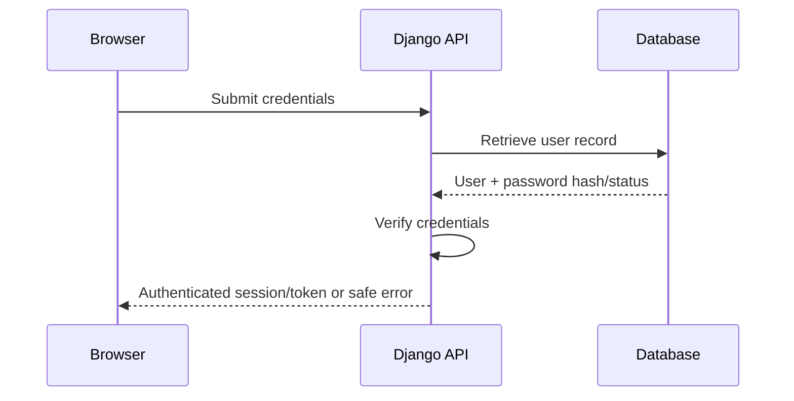

# Authentication

**Status:** Security baseline
**Last updated:** 2026-10-06

## Purpose

Define how GlintPM Private should establish and maintain the identity of users.

## Authentication requirements

- Authentication must be server-controlled.
- Passwords must never be stored in plaintext.
- Password verification must use Django's supported password-hashing mechanisms or an approved identity provider.
- Authentication endpoints must use HTTPS in non-local environments.
- Failed authentication responses should avoid revealing whether an account exists where practical.
- Authentication events should be observable without recording passwords, tokens, or other secrets.

## Conceptual flow

## Session/token handling

The exact mechanism must be confirmed against the implementation. Regardless of mechanism:

- Credentials and authentication artifacts must be transmitted only over HTTPS in production.
- Cookies, if used, should use appropriate `Secure`, `HttpOnly`, and `SameSite` settings.
- CSRF protection must be applied where cookie-based authentication is used.
- Tokens must have appropriate expiration and revocation behavior if token authentication is used.
- Authentication artifacts must not appear in application logs, URLs, analytics, or error messages.

## Account lifecycle

The system should support controlled states such as active, suspended, and deactivated. Deactivated or suspended users must not retain effective application access.

## Password security

Where passwords are supported:

- Enforce a reasonable minimum length.
- Prefer passphrases over arbitrary complexity rules.
- Rate-limit repeated authentication failures.
- Provide secure password reset flows.
- Never email or display a user's existing password.

## Related controls

See `authorization.md`, `roles-and-permissions.md`, `secrets-management.md`, and `incident-response.md`.

## Implementation note

The exact authentication library, session/token strategy, MFA support, and account lifecycle behavior must be verified against the repository before being treated as implemented requirements.
