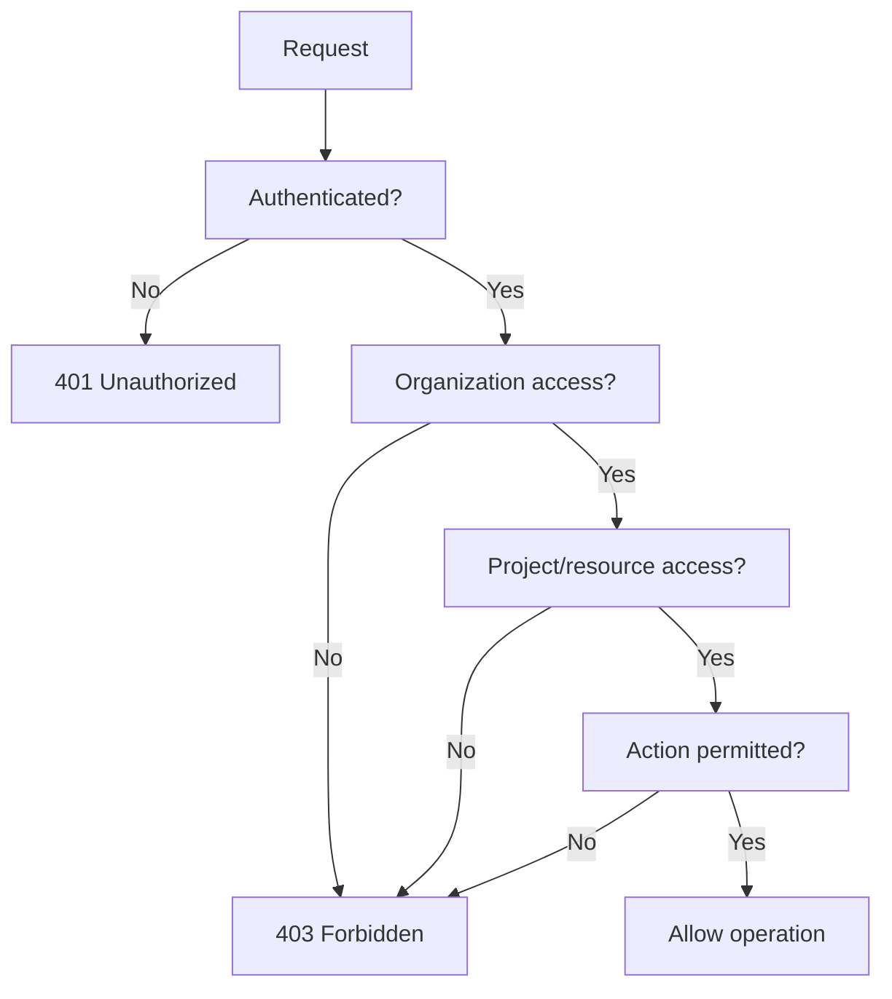

# Authorization

**Status:** Security baseline
**Last updated:** 2026-10-06

## Purpose

Define how GlintPM Private determines what an authenticated user is allowed to access or change.

## Core rule

Authentication answers **who are you?** Authorization answers **what are you allowed to do?** An authenticated user must not automatically receive access to project or organizational data.

## Authorization layers

Authorization should be enforced at multiple relevant layers:

1. **Organization scope** — user belongs to or is granted access to the organization.
2. **Project scope** — user has access to the specific project.
3. **Resource scope** — user may access the particular schedule, cost, progress, risk, or report resource.
4. **Action scope** — user may perform the requested operation, such as read, create, update, approve, export, or delete.

## Server-side enforcement

Authorization must never depend solely on frontend route guards, hidden buttons, or client-side state. Every protected API operation must independently enforce access rules.

## Tenant isolation

For the planned shared-database multi-tenant model:

- Organization ownership or membership must be explicit.
- Queries must be scoped to the authorized organization.
- Object-level access must be checked before returning or modifying data.
- Cross-organization identifiers must not be sufficient to obtain data.

## Privileged actions

Actions such as approving schedules, changing financial information, exporting sensitive reports, managing users, or changing permissions should receive stronger authorization and audit treatment.

## Implementation note

The final permission checks, middleware, Django permissions, querysets, and policy services must be verified in the codebase.
