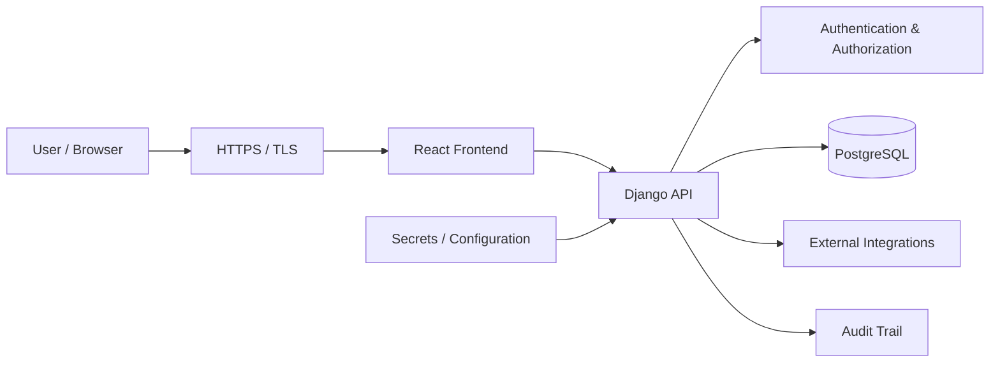

# Security Overview

**Status:** Security baseline
**Last updated:** 2026-10-06

## Purpose

Define the security principles and baseline controls for GlintPM Private.

## Security objectives

- Protect project, commercial, financial, and user data.
- Prevent unauthorized access across organizations and projects.
- Preserve confidentiality, integrity, and availability.
- Detect and investigate security-relevant activity.
- Minimize the impact of compromised accounts, services, or credentials.

## Security principles

1. Least privilege by default.
2. Deny access unless explicitly authorized.
3. Enforce organization and project boundaries server-side.
4. Validate untrusted input at system boundaries.
5. Never store or log plaintext secrets or passwords.
6. Prefer secure framework defaults.
7. Audit security-sensitive and business-critical actions.
8. Keep dependencies and infrastructure patched.
9. Fail safely without exposing sensitive implementation details.
10. Treat security as a lifecycle concern rather than a final testing step.

## Security boundaries

## Baseline threat areas

- Account takeover and credential theft.
- Broken authentication or authorization.
- Cross-tenant data access.
- Injection and unsafe deserialization.
- Cross-site scripting and CSRF.
- Sensitive data exposure.
- Insecure file import/export.
- Abuse of APIs and reporting endpoints.
- Dependency and supply-chain vulnerabilities.
- Misconfigured production infrastructure.

## Implementation note

This document defines the intended security baseline. Repository code, tests, deployment configuration, and infrastructure remain the source of truth for what is actually implemented.
