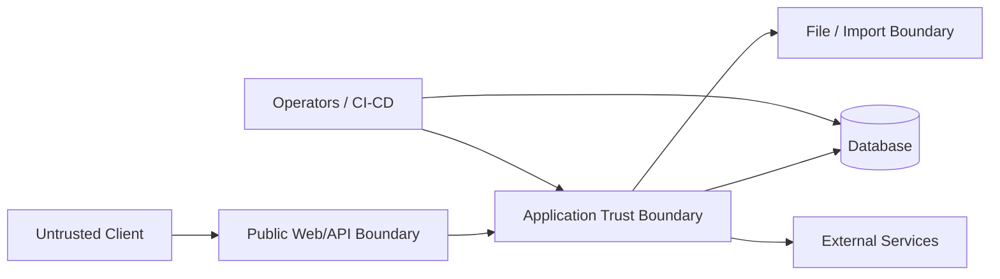

# Threat Model

**Status:** Initial security threat model
**Last updated:** 2026-10-06

## Purpose

Identify major threats to GlintPM Private and establish a repeatable way to assess and mitigate them.

## Assets

- User identities and credentials.
- Organization membership and permissions.
- Project schedules and planning data.
- Cost and financial information.
- Progress and performance information.
- Risk registers.
- Reports and exports.
- Audit records.
- Application secrets and infrastructure credentials.
- Database contents and backups.

## Trust boundaries

## Threat register

| Threat | Potential impact | Primary controls |
|---|---|---|
| Account takeover | Unauthorized access | Strong password handling, rate limiting, MFA where appropriate, monitoring |
| Broken object authorization | Cross-project or cross-tenant disclosure | Server-side object checks, scoped queries, authorization tests |
| SQL/injection attacks | Data compromise | ORM/query parameterization, validation, secure coding |
| XSS | Session/data compromise | Output encoding, sanitization, CSP where appropriate |
| CSRF | Unauthorized state changes | CSRF protection for cookie-authenticated workflows |
| Credential leakage | System compromise | Secrets management, log hygiene, rotation |
| Malicious import | Data corruption or code execution | File validation, size/type limits, safe parsing |
| Excessive API use | Availability degradation | Rate limiting, pagination, quotas, monitoring |
| Supply-chain compromise | Application compromise | Dependency pinning/scanning, update process |
| Data loss | Operational/business impact | Backups, restore testing, integrity controls |

## Risk analysis method

For each threat assess:

`Risk = Likelihood × Impact`

Use a documented scoring scale and prioritize threats with high residual risk.

## Abuse cases

Security testing should include attempts to:

- Access another organization's project by changing an identifier.
- Access an unauthorized project through direct API calls.
- Modify data using a read-only account.
- Reuse expired or revoked authentication artifacts.
- Upload unexpected file types or oversized files.
- Extract secrets through error responses or logs.
- Bypass approval workflows through direct API requests.

## Maintenance

Review this threat model when major architecture, authentication, data, integration, or deployment changes occur.
